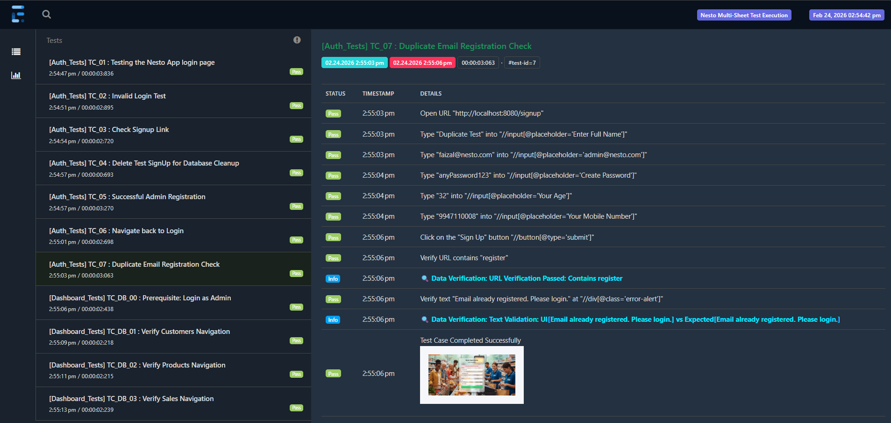

<div align="center">

# 🧪 NESTO AUTOMATION FRAMEWORK
### *Robust Selenium Keyword-Driven Testing Engine using Excel Sheets*

[](https://www.oracle.com/java/)
[](https://www.selenium.dev/)
[](https://maven.apache.org/)
[](https://www.extentreports.com/)

**Automated Keyword Driven Testing for the Nesto Supermarket Application**
</div>

---

## 📖 Overview
The **Nesto Automation Framework** is a high-performance, modular testing suite designed specifically to validate the [Nesto Supermarket App](https://github.com/faizal08/Nesto_supermarket_app). It utilizes a **Keyword-Driven Approach**, parsing test cases from Excel to execute complex user journeys through Selenium WebDriver.

---

## 📸 Test Reporting Preview
The framework generates rich, interactive HTML reports. Each test step includes automatic failure screenshots for rapid debugging.



---

## 🏗️ Framework Architecture
The framework follows a modular design to ensure high maintainability and reusability:

* **📂 Core:** Contains main class and Test Executor class Manages WebDriver initialization, browser factory logic, and base test configurations.
* **📂 Utils:** Contains helper methods for Excel Reader and Database Utils.
* **📂 Parser:** The data engine that reads and maps test data from **Excel (Apache POI)** to the test scripts.
* **📂 Actions:** The engine that make selenium work like click actions, type actions , verify actions and wait actions.
* **📂 Selenium Engine:** Handles low-level UI interactions (Click, Type, Select) with robust error handling.


---

## ✨ Key Features
* **📊 Excel-Driven Testing:** No need to touch code to change test data; simply update the Excel sheet.
* **📸 Automated Screenshots:** Captures the UI state for every test case, automatically embedding them into reports.
* **📈 Extent Reports:** Generates professional-grade HTML reports with status charts (Pass/Fail/Skip) and detailed logs.
* **🛠️ Modular Design:** Clean separation between test logic and framework utilities.

---

## 💻 Tech Stack
| Component | Technology |
| :--- | :--- |
| **Language** | Java 21 |
| **Automation Tool** | Selenium WebDriver |
| **Data Parsing** | Apache POI (Excel) |
| **Reporting** | ExtentReports |
| **Build Tool** | Maven |

---

## 🚦 Getting Started

### Prerequisites
* **JDK 21**
* **Maven**
* **Chrome Browser** (and corresponding Drivers)

### Setup & Execution

### I - Installation & Setup of   Nesto_supermarket_app

To set up Nesto_supermarket_app locally, follow these steps:

1. Clone the repository:
```bash
   git clone https://github.com/faizal08/Nesto_supermarket_app.git
  
```

2. Navigate to the project directory:
```bash
cd Nesto_supermarket_app

````
3. Install the required dependencies:
 ```bash
 ./mvnw install

```
4. Configure your application.properties file with your database credentials:
```bash

spring.datasource.url=jdbc:postgresql://localhost:5432/nesto_db
spring.datasource.username=your_username
spring.datasource.password=your_password
```
5. Run the application:
```bash
./mvnw spring-boot:run
```

## Usage

1. Open your web browser and navigate to [http://localhost:8080](http://localhost:8080)
2. Create an account or log in to access the store.
3. Add products, customers,create sales and generate invoice for sale.
4.Dont Stop Run as we are going test it using Nesto Automation Framework.

### II - Installation & Setup of   Nesto_Automation_Framework

1. **Clone the Framework:**
   ```bash
   git clone [https://github.com/faizal08/Nesto_Automation_Framework.git](https://github.com/faizal08/Nesto_Automation_Framework.git)
   `````
2. Navigate to the project directory:
```bash
cd Nesto_Automation_Framework
`````````

3. Run the application:
```bash
mvn compile exec:java -Dexec.mainClass="com.nesto.automation.core.Main"
```
Test will automatically pop up in chrome

5. View Test Reports :

1.Look at the project file tree on the left.
2.Open the reports folder.
3.Right-click on Nesto_Automation_Report.html.
4.Select Open in Browser -> Chrome
5.You can view report like given Below


## Contact

For any inquiries or feedback, feel free to reach out:

- **Email:** [reachfaizal08@gmail.com](reachfaizal08@gmail.com)
- **GitHub:** [faizal08](https://github.com/faizal08)

   
